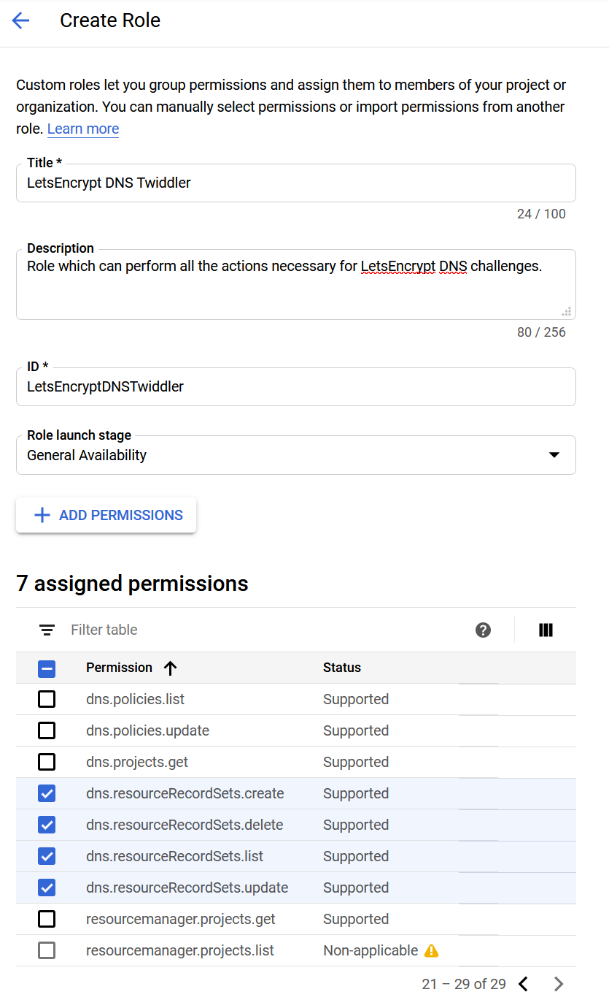
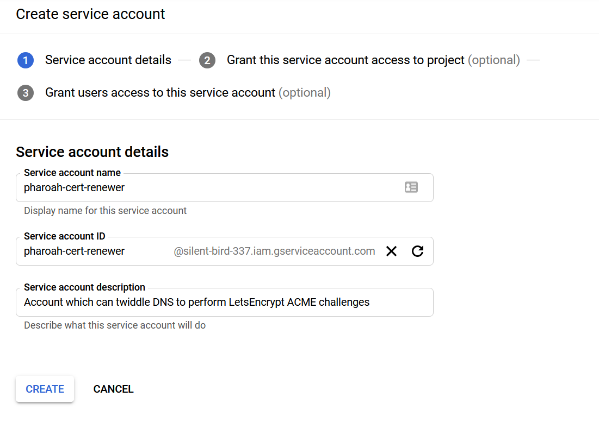
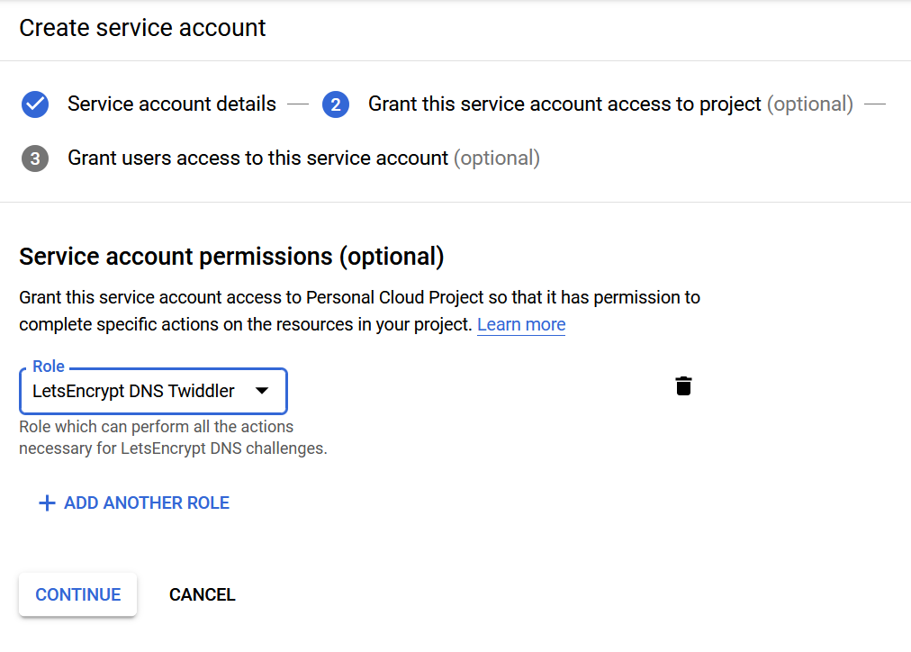

This is part one-point-five of my effort to configure new lab infrastructure. It
was written mainly for my own reference during the process and later, when I
inevitably need to figure out WTF I did. This part preceeds my attempt to get
FreeNAS authenticating against the DC, because it turns out having trusted certs
is a prerequisite for that. It's best when your infrastructure trusts itself.

## Securing Things

To get trusted certificates, we have to do some magic with certbot and
letsencrypt to issue certs for the various services. Luckily, there's just one
place to set up certificates for Samba.

To pull this off, we're going to leave our internal infrastructure. LetsEncrypt
verifies that we are who we say we are during certificate renewal through a
variety of ACME challenge methods. The most popular is an HTTP-based chellenge,
but that doesn't work very well when you don't have a HTTP server. In this case,
we're going to use the DNS-based challenge, which drops a `TXT` record in DNS.
Public DNS for `funkhouse.rs` is already handled by Google Cloud DNS. As luck
would have it, `certbot` includes a [Google Cloud DNS
plugin](https://certbot-dns-google.readthedocs.io/en/stable/) to automate most
of the work here.

### Set up Google Cloud DNS

In order for that tool to work, I need a service account on GCP that can modify
my DNS records. First, I need to create a role which has the permissions listed
on the plugin page, above. I accomplished this by cloning the _DNS
Administrator_ role and removing the things I didn't want it to do.



Now, I create a Service account which can fulfill this role for our DC, and
assign it to the role.





Finally, I created a key for this service account and downloaded the JSON file.
This file I placed at
`/var/lib/letsencrypt/pharoah-cert-renewer-credentials.json`, owned by `root`,
with permissions `400`.

### Let's Encrypt!

First, install `certbot` and the Google DNS plugin using: `sudo apt install
certbot python3-certbot-dns-google`.

Then, try it out:

```console
christian@pharoah:tls$ sudo certbot certonly \
>   --dns-google \
>   --dns-google-credentials /var/lib/letsencrypt/pharoah-cert-renewer-credentials.json \
>   -d pharoah.home.funkhouse.rs
Saving debug log to /var/log/letsencrypt/letsencrypt.log
Plugins selected: Authenticator dns-google, Installer None
Obtaining a new certificate
Performing the following challenges:
dns-01 challenge for pharoah.home.funkhouse.rs
URL being requested: GET https://www.googleapis.com/discovery/v1/apis/dns/v1/rest
URL being requested: GET https://dns.googleapis.com/dns/v1/projects/REDACTED/managedZones?dnsName=pharoah.home.funkhouse.rs.&alt=json
Attempting refresh to obtain initial access_token
Refreshing access_token
URL being requested: GET https://dns.googleapis.com/dns/v1/projects/REDACTED/managedZones?dnsName=home.funkhouse.rs.&alt=json
URL being requested: GET https://dns.googleapis.com/dns/v1/projects/REDACTED/managedZones?dnsName=funkhouse.rs.&alt=json
URL being requested: GET https://dns.googleapis.com/dns/v1/projects/REDACTED/managedZones/REDACTED/rrsets?alt=json
URL being requested: POST https://dns.googleapis.com/dns/v1/projects/REDACTED/managedZones/REDACTED/changes?alt=json
URL being requested: GET https://dns.googleapis.com/dns/v1/projects/REDACTED/managedZones/REDACTED/changes/16?alt=json
URL being requested: GET https://dns.googleapis.com/dns/v1/projects/REDACTED/managedZones/REDACTED/changes/16?alt=json
URL being requested: GET https://dns.googleapis.com/dns/v1/projects/REDACTED/managedZones/REDACTED/changes/16?alt=json
URL being requested: GET https://dns.googleapis.com/dns/v1/projects/REDACTED/managedZones/REDACTED/changes/16?alt=json
Waiting 60 seconds for DNS changes to propagate
Waiting for verification...
Cleaning up challenges
URL being requested: GET https://www.googleapis.com/discovery/v1/apis/dns/v1/rest
URL being requested: GET https://dns.googleapis.com/dns/v1/projects/REDACTED/managedZones?dnsName=pharoah.home.funkhouse.rs.&alt=json
Attempting refresh to obtain initial access_token
Refreshing access_token
URL being requested: GET https://dns.googleapis.com/dns/v1/projects/REDACTED/managedZones?dnsName=home.funkhouse.rs.&alt=json
URL being requested: GET https://dns.googleapis.com/dns/v1/projects/REDACTED/managedZones?dnsName=funkhouse.rs.&alt=json
URL being requested: GET https://dns.googleapis.com/dns/v1/projects/REDACTED/managedZones/REDACTED/rrsets?alt=json
URL being requested: POST https://dns.googleapis.com/dns/v1/projects/REDACTED/managedZones/REDACTED/changes?alt=json

IMPORTANT NOTES:
 - Congratulations! Your certificate and chain have been saved at:
   /etc/letsencrypt/live/pharoah.home.funkhouse.rs/fullchain.pem
   Your key file has been saved at:
   /etc/letsencrypt/live/pharoah.home.funkhouse.rs/privkey.pem
   Your cert will expire on 2020-03-02. To obtain a new or tweaked
   version of this certificate in the future, simply run certbot
   again. To non-interactively renew *all* of your certificates, run
   "certbot renew"
 - If you like Certbot, please consider supporting our work by:

   Donating to ISRG / Let's Encrypt:   https://letsencrypt.org/donate
   Donating to EFF:                    https://eff.org/donate-le

OK 01 Dec 2019 09:47:38 EST
```

Not too shabby!

### Configuring Samba

Now that we have certificates, let's toss them at Samba. First, we need to copy
the crypto material into the Samba TLS directory to avoid mucking with the perms
under `/etc/letsencrypt`.

```console
christian@pharoah:~$ sudo rm /var/lib/samba/private/tls/*.pem
OK 01 Dec 2019 11:03:46 EST
christian@pharoah:~$ sudo cp -L \
>  /etc/letsencrypt/live/pharoah.home.funkhouse.rs/{cert,chain,fullchain,privkey}.pem \
>  /var/lib/samba/private/tls/
OK 01 Dec 2019 11:04:01 EST
christian@pharoah:~$ ls -l /var/lib/samba/private/tls/
total 20
-rw-r--r-- 1 root root 1923 Dec  1 11:04 cert.pem
-rw-r--r-- 1 root root 1647 Dec  1 11:04 chain.pem
-rw-r--r-- 1 root root 3582 Dec  1 11:04 fullchain.pem
-rw------- 1 root root 1704 Dec  1 11:04 privkey.pem
OK 01 Dec 2019 11:04:12 EST
```

Crack open `/etc/samab/smb.conf` and add the following section:

```text
tls enabled  = yes
tls keyfile  = tls/privkey.pem
tls certfile = tls/cert.pem
tls cafile   = tls/chain.pem
```

Then restart Samba, and see how it likes those values.

```console
christian@pharoah:~$ sudo systemctl restart samba-ad-dc
OK 01 Dec 2019 13:43:09 EST
christian@pharoah:~$ sudo systemctl status samba-ad-dc
● samba-ad-dc.service - Samba AD Daemon
   Loaded: loaded (/lib/systemd/system/samba-ad-dc.service; enabled; vendor preset: enabled)
   Active: active (running) since Sun 2019-12-01 13:43:09 EST; 5s ago
... trimmed ...
OK 01 Dec 2019 13:43:14 EST
```

Well, that's promising. Now let's get a look at that certificate. Samba serves
LDAPS on port 636, so we'll point `openssl` at it.

```console
christian@pharoah:~$ echo -n \
>   | sudo openssl s_client \
>     -connect pharoah.home.funkhouse.rs:636 \
>     -CApath /etc/ssl/certs/ \
>   | sed -ne '/-END CERTIFICATE-/,/DONE/p'
Can't use SSL_get_servername
depth=0 CN = pharoah.home.funkhouse.rs
verify error:num=20:unable to get local issuer certificate
verify return:1
depth=0 CN = pharoah.home.funkhouse.rs
verify error:num=21:unable to verify the first certificate
verify return:1
DONE
-----END CERTIFICATE-----
subject=CN = pharoah.home.funkhouse.rs

issuer=C = US, O = Let's Encrypt, CN = Let's Encrypt Authority X3

---
Acceptable client certificate CA names
C = US, O = Let's Encrypt, CN = Let's Encrypt Authority X3
Requested Signature Algorithms: RSA+SHA256:RSA-PSS+SHA256:RSA-PSS+SHA256:ECDSA+SHA256:Ed25519:RSA+SHA384:RSA-PSS+SHA384:RSA-PSS+SHA384:ECDSA+SHA384:RSA+SHA512:RSA-PSS+SHA512:RSA-PSS+SHA512:ECDSA+SHA512:RSA+SHA1:ECDSA+SHA1
Shared Requested Signature Algorithms: RSA+SHA256:RSA-PSS+SHA256:RSA-PSS+SHA256:ECDSA+SHA256:Ed25519:RSA+SHA384:RSA-PSS+SHA384:RSA-PSS+SHA384:ECDSA+SHA384:RSA+SHA512:RSA-PSS+SHA512:RSA-PSS+SHA512:ECDSA+SHA512
Peer signing digest: SHA256
Peer signature type: RSA-PSS
Server Temp Key: X25519, 253 bits
---
SSL handshake has read 2085 bytes and written 393 bytes
Verification error: unable to verify the first certificate
---
New, TLSv1.3, Cipher is TLS_AES_256_GCM_SHA384
Server public key is 2048 bit
Secure Renegotiation IS NOT supported
Compression: NONE
Expansion: NONE
No ALPN negotiated
Early data was not sent
Verify return code: 21 (unable to verify the first certificate)
---
OK 01 Dec 2019 13:48:46 EST
```

That's close. The `verify error:num=20:unable to get local issuer certificate`
error means that openssl doesn't have enough information to verify this cert.
Instead of shipping back just the end entity certificate, we can ship back the
whole chain using the `fullchain.pem` provided by Let's Encrypt. Make the tls
bits of `smb.conf` look like this:

```text
tls enabled  = yes
tls keyfile  = tls/privkey.pem
tls certfile = tls/fullchain.pem
tls cafile   = tls/chain.pem
```

Then `sudo systemctl restart samba-ad-dc` and check again:

```console
christian@pharoah:~$ echo -n \
>   | sudo openssl s_client \
>     -connect pharoah.home.funkhouse.rs:636 \
>     -CApath /etc/ssl/certs/ \
>   | sed -ne '/-END CERTIFICATE-/,/DONE/p'
depth=2 O = Digital Signature Trust Co., CN = DST Root CA X3
verify return:1
depth=1 C = US, O = Let's Encrypt, CN = Let's Encrypt Authority X3
verify return:1
depth=0 CN = pharoah.home.funkhouse.rs
verify return:1
DONE
-----END CERTIFICATE-----
subject=CN = pharoah.home.funkhouse.rs

issuer=C = US, O = Let's Encrypt, CN = Let's Encrypt Authority X3

---
Acceptable client certificate CA names
C = US, O = Let's Encrypt, CN = Let's Encrypt Authority X3
Requested Signature Algorithms: RSA+SHA256:RSA-PSS+SHA256:RSA-PSS+SHA256:ECDSA+SHA256:Ed25519:RSA+SHA384:RSA-PSS+SHA384:RSA-PSS+SHA384:ECDSA+SHA384:RSA+SHA512:RSA-PSS+SHA512:RSA-PSS+SHA512:ECDSA+SHA512:RSA+SHA1:ECDSA+SHA1
Shared Requested Signature Algorithms: RSA+SHA256:RSA-PSS+SHA256:RSA-PSS+SHA256:ECDSA+SHA256:Ed25519:RSA+SHA384:RSA-PSS+SHA384:RSA-PSS+SHA384:ECDSA+SHA384:RSA+SHA512:RSA-PSS+SHA512:RSA-PSS+SHA512:ECDSA+SHA512
Peer signing digest: SHA256
Peer signature type: RSA-PSS
Server Temp Key: X25519, 253 bits
---
SSL handshake has read 3273 bytes and written 427 bytes
Verification: OK
---
New, TLSv1.3, Cipher is TLS_AES_256_GCM_SHA384
Server public key is 2048 bit
Secure Renegotiation IS NOT supported
Compression: NONE
Expansion: NONE
No ALPN negotiated
Early data was not sent
Verify return code: 0 (ok)
---
OK 01 Dec 2019 13:56:48 EST
```

Awwww yeah. Looks like it worked. Now that we're sure Samba will serve traffic
using the Let's Encrypt certificates, let's try to get it working with the
symlinks to the certificate files so we can use automatic renewal.

First, delete the certificates in their current location with `sudo rm
/var/lib/samba/private/tls/*pem`

Then, make the TLS section of `/etc/samba/smb.conf` look like this:

```text
tls enabled  = true
tls keyfile  = /etc/letsencrypt/live/pharoah.home.funkhouse.rs/privkey.pem
tls certfile = /etc/letsencrypt/live/pharoah.home.funkhouse.rs/fullchain.pem
tls cafile   = /etc/letsencrypt/live/pharoah.home.funkhouse.rs/chain.pem
```

And re-verify:

```console
christian@pharoah:~$ sudo systemctl restart samba-ad-dc
OK 01 Dec 2019 13:58:38 EST
christian@pharoah:~$ sudo systemctl status samba-ad-dc
● samba-ad-dc.service - Samba AD Daemon
   Loaded: loaded (/lib/systemd/system/samba-ad-dc.service; enabled; vendor preset: enabled)
   Active: active (running) since Sun 2019-12-01 13:58:38 EST; 2s ago
... trimmed ...
OK 01 Dec 2019 13:58:40 EST
christian@pharoah:~$ echo -n \
>   | sudo openssl s_client \
>     -connect pharoah.home.funkhouse.rs:636 \
>     -CApath /etc/ssl/certs/ \
>   | sed -ne '/-END CERTIFICATE-/,/DONE/p'
... trimmed ...
---
SSL handshake has read 3273 bytes and written 427 bytes
Verification: OK
---
... trimmed ...
OK 01 Dec 2019 13:58:45 EST
```

Awesome. The symlinks work. This means that now we can just install a SystemD
timer that renews our Samba certificates, and give it a post hook to restart
Samba for us. Certbot comes with a renewal SystemD service and timer. Looking in
on the timer:

```console
christian@pharoah:~$ sudo systemctl list-timers certbot.timer
NEXT                         LEFT     LAST                         PASSED       UNIT          ACTIVATES
Mon 2019-12-02 01:34:42 EST  11h left Sun 2019-12-01 12:34:39 EST  1h 48min ago certbot.timer certbot.service

1 timers listed.
Pass --all to see loaded but inactive timers, too.
OK 01 Dec 2019 14:23:06 EST
```

Looks fine, but we need to make sure Samba is restarted when the certificate is
renewed. To do this, I've modified `certbot.service` to look like this:

```text
[Unit]
Description=Certbot
Documentation=file:///usr/share/doc/python-certbot-doc/html/index.html
Documentation=https://letsencrypt.readthedocs.io/en/latest/
[Service]
Type=oneshot
ExecStart=/usr/bin/certbot -q renew --post-hook "systemctl restart samba-ad-dc"
PrivateTmp=true
```

And that ought to do it.

## Postscript

That was legitimately fun. Next up: _Actually_ configuring FreeNAS to work with
this DC, so shares can live somewhere provisioned for actual storage.
