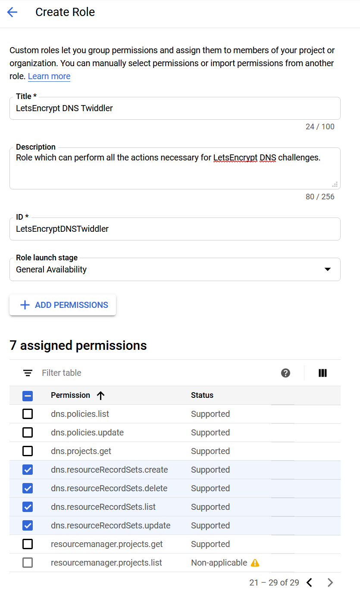

This is part two of my effort to configure new lab infrastructure. It was
written mainly for my own reference during the process and later, when I
inevitably need to figure out WTF I did. This part focuses on getting my FreeNAS
authenticating against my DC, and convincing the DC to mount home directories
and other shares from the NAS when clients join.

## Securing Things

Before I get started, I need to make sure that my infrastructure trusts itself.
To get trusted certificates, we have to do some magic with certbot and
letsencrypt to issue certs for the various services. Luckily, there's just one
place to set up certificates for Samba.

To pull this off, we're going to leave our internal infrastructure. LetsEncrypt
verifies that we are who we say we are during certificate renewal through a
variety of ACME challenge methods. The most popular is an HTTP-based chellenge,
but that doesn't work very well when you don't have a HTTP server. In this case,
we're going to use the DNS-based challenge, which drops a `TXT` record in DNS.
Public DNS for `funkhouse.rs` is already handled by Google Cloud DNS. As luck
would have it, `certbot` includes a [Google Cloud DNS
plugin](https://certbot-dns-google.readthedocs.io/en/stable/) to automate most
of the work here.

### Set up Google Cloud DNS

In order for that tool to work, I need a service account on GCP that can modify
my DNS records. First, I need to create a role which has the permissions listed
on the plugin page, above. I accomplished this by cloning the _DNS
Administrator_ role and removing the things I didn't want it to do.



Now, I create a Service account which can fulfill this role for our DC, and
assign it to the role.


Finally, I created a key for this service account and downloaded the JSON file.
This file I placed at
`/var/lib/letsencrypt/pharoah-cert-renewer-credentials.json`, owned by `root`,
with permissions `400`.

### Let's Encrypt!

First, install `certbot` and the Google DNS plugin using: `sudo apt install
certbot python3-certbot-dns-google`.

Then, try it out:

```console
christian@pharoah:~$ sudo certbot certonly --dns-google --dns-google-credentials /var/lib/letsencrypt/pharoah-cert-renewer-credentials.json -d pharoah.funkhouse.rs
Saving debug log to /var/log/letsencrypt/letsencrypt.log
Plugins selected: Authenticator dns-google, Installer None
Enter email address (used for urgent renewal and security notices) (Enter 'c' to
cancel): REDACTED

- - - - - - - - - - - - - - - - - - - - - - - - - - - - - - - - - - - - - - - -
Please read the Terms of Service at
https://letsencrypt.org/documents/LE-SA-v1.2-November-15-2017.pdf. You must
agree in order to register with the ACME server at
https://acme-v02.api.letsencrypt.org/directory
- - - - - - - - - - - - - - - - - - - - - - - - - - - - - - - - - - - - - - - -
(A)gree/(C)ancel: A

- - - - - - - - - - - - - - - - - - - - - - - - - - - - - - - - - - - - - - - -
Would you be willing to share your email address with the Electronic Frontier
Foundation, a founding partner of the Let's Encrypt project and the non-profit
organization that develops Certbot? We'd like to send you email about our work
encrypting the web, EFF news, campaigns, and ways to support digital freedom.
- - - - - - - - - - - - - - - - - - - - - - - - - - - - - - - - - - - - - - - -
(Y)es/(N)o: Y
Obtaining a new certificate
Performing the following challenges:
dns-01 challenge for pharoah.funkhouse.rs
URL being requested: GET https://www.googleapis.com/discovery/v1/apis/dns/v1/rest
URL being requested: GET https://dns.googleapis.com/dns/v1/projects/REDACTED/managedZones?dnsName=pharoah.funkhouse.rs.&alt=json
Attempting refresh to obtain initial access_token
Refreshing access_token
URL being requested: GET https://dns.googleapis.com/dns/v1/projects/REDACTED/managedZones?dnsName=funkhouse.rs.&alt=json
URL being requested: GET https://dns.googleapis.com/dns/v1/projects/REDACTED/managedZones/REDACTED/rrsets?alt=json
URL being requested: POST https://dns.googleapis.com/dns/v1/projects/REDACTED/managedZones/REDACTED/changes?alt=json
URL being requested: GET https://dns.googleapis.com/dns/v1/projects/REDACTED/managedZones/REDACTED/changes/12?alt=json
URL being requested: GET https://dns.googleapis.com/dns/v1/projects/REDACTED/managedZones/REDACTED/changes/12?alt=json
URL being requested: GET https://dns.googleapis.com/dns/v1/projects/REDACTED/managedZones/REDACTED/changes/12?alt=json
URL being requested: GET https://dns.googleapis.com/dns/v1/projects/REDACTED/managedZones/REDACTED/changes/12?alt=json
Waiting 60 seconds for DNS changes to propagate
Waiting for verification...
Cleaning up challenges
URL being requested: GET https://www.googleapis.com/discovery/v1/apis/dns/v1/rest
URL being requested: GET https://dns.googleapis.com/dns/v1/projects/REDACTED/managedZones?dnsName=pharoah.funkhouse.rs.&alt=json
Attempting refresh to obtain initial access_token
Refreshing access_token
URL being requested: GET https://dns.googleapis.com/dns/v1/projects/REDACTED/managedZones?dnsName=funkhouse.rs.&alt=json
URL being requested: GET https://dns.googleapis.com/dns/v1/projects/REDACTED/managedZones/REDACTED/rrsets?alt=json
URL being requested: POST https://dns.googleapis.com/dns/v1/projects/REDACTED/managedZones/REDACTED/changes?alt=json

IMPORTANT NOTES:
 - Congratulations! Your certificate and chain have been saved at:
   /etc/letsencrypt/live/pharoah.funkhouse.rs/fullchain.pem
   Your key file has been saved at:
   /etc/letsencrypt/live/pharoah.funkhouse.rs/privkey.pem
   Your cert will expire on 2020-02-29. To obtain a new or tweaked
   version of this certificate in the future, simply run certbot
   again. To non-interactively renew *all* of your certificates, run
   "certbot renew"
 - Your account credentials have been saved in your Certbot
   configuration directory at /etc/letsencrypt. You should make a
   secure backup of this folder now. This configuration directory will
   also contain certificates and private keys obtained by Certbot so
   making regular backups of this folder is ideal.
 - If you like Certbot, please consider supporting our work by:

   Donating to ISRG / Let's Encrypt:   https://letsencrypt.org/donate
   Donating to EFF:                    https://eff.org/donate-le

OK 01 Dec 2019 09:47:38 EST
```

Not too shabby!
